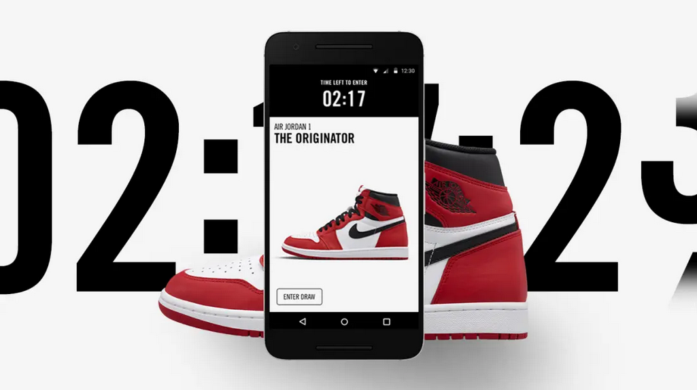

<!-- PROJECT LOGO -->
<br />
<p align="center">
  <a >
    
  </a>

  <h3 align="center">snkrs-bot</h3>

  <p align="center">
    This is a simple bot using Node.js / puppeteer that buys a Nike shoe when it drops.
    <br />
  </p>
</p>


<!-- TABLE OF CONTENTS -->
## Table of Contents

* [About the Project](#about-the-project)
  * [Built With](#built-with)
* [Getting Started](#getting-started)
  * [Prerequisites](#prerequisites)
  * [Installation](#installation)
* [Usage](#usage)


<!-- ABOUT THE PROJECT -->
## About The Project
A fully automated sneaker bot for purchasing exclusive sneakers on the Nike SNKR's site.


### Built With

* [Node.js](https://nodejs.org/en/)
* [Puppeteer](https://github.com/puppeteer/puppeteer)
* [Node Cron](https://github.com/node-cron/node-cron)


<!-- GETTING STARTED -->
## Getting Started

To get a local copy up and running follow these simple steps.

### Prerequisites

You must already have a valid [Nike](https://nike.com) account and credit card tied to the account. 


* yarn
```sh
yarn upgrade --latest
```
* npm 
```sh
npm install npm@latest -g
```


### Installation
 
1. Clone the repo
```sh
git clone https://github.com/mosuswalks/snkrs-bot.git
```
2. Install NPM packages
```sh
yarn install
```
or
```sh
npm install
```

<!-- USAGE EXAMPLES -->
## Usage

1. You'll need to reate a .env file and add the following variables.

```sh
EMAIL=youremail@example.com
PASS=yournikeaccountpassword
CVC=yourcreditcardcvc
```

2. In the bot.js file, edit the following lines.


3. Run the script like you normally would or by invoking the Cron Job (currently set to 6am)

```sh
node bot.js
```

or 

```ch
node cron.js
```


